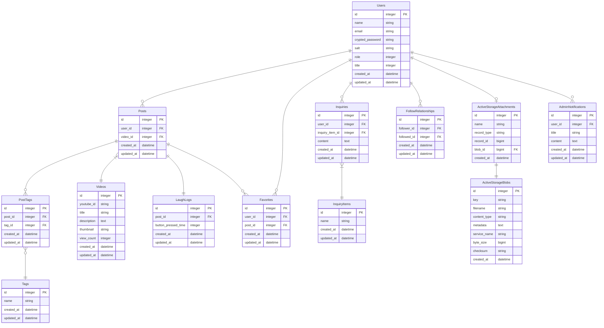

## サービス名
**ネタチューブ**

## ■ サービス概要
お笑いの動画を見ながら、自分が笑ったタイミングを記録し、その記録をシェアできるサービス
## ■ メインのターゲットユーザー
Youtubeで漫才・コントの動画をよく見る人
## ■ ユーザーが抱える課題
- みんながどんな動画を見て、どこが面白いと思っているか気になる
- 再生回数やYouTubeのオススメではなく、自分が笑える動画を見つけたい
- 自分と笑いのツボが近い人がオススメする動画を見たい
- 自分が好きなジャンル以外の動画も見てみたい
## ■ 解決方法
ユーザーがどんな動画を見て、どのタイミングで笑ったか記録・可視化する
## ■ 実装予定の機能
【MVPリリース】

- 動画検索機能
- 動画閲覧・笑いログ記録機能
- 笑いログ投稿機能・編集・削除機能

【本リリース】
- 未ログインユーザー
  - ユーザー登録機能
    - ゲストログイン
    - googleログイン
    - twitterログイン
  - タグ機能
    - タグ付け
    - タグ検索
  - いいね(お気に入り)機能
  - フォロー/フォロワー機能
  - おすすめ動画表示機能
    - 賞レース出場者(M1グランプリ出場者・キングオブコント出場者など)
    - フォローユーザーの投稿一覧
  - 問い合わせ機能
  - お知らせ
  - 利用規約
  - プライバシーポリシー
- ログインユーザー
  - ログアウト機能
  - 退会機能
  - パスワードリセット機能
  - プロフィール機能
  - バッジ機能(投稿数に応じてステータス変更)
- 管理者ユーザー
  - ユーザー管理(一覧・詳細・編集・削除)
  - 投稿管理(一覧・詳細・編集・削除)
  - 問い合わせ管理(一覧・詳細)
  - お知らせ管理(一覧・作成・詳細・編集・削除)
## ■ なぜこのサービスを作りたいのか？
笑いのツボは人それぞれであるため、「再生数が多い動画 = 自分が面白いと思う動画」であるとは限らない。どんな人がどの動画を見て、いつ笑っているのか知りたいと思った。

## ■ 画面遷移図
[figma](https://www.figma.com/file/aE882ms6OxT3FvQ2xKmBh1/%E3%83%9D%E3%83%BC%E3%83%88%E3%83%95%E3%82%A9%E3%83%AA%E3%82%AA%E7%94%BB%E9%9D%A2%E9%81%B7%E7%A7%BB%E5%9B%B3?node-id=0%3A1&t=F9nUidzvuwr0iywU-1)

## ■ ER図

## ■ スケジュール
企画〜技術調査：12/20~12/24〆切

README〜ER図作成：12/31〆切

メイン機能実装：1/1~1/15〆切

MVPリリース：1/15〆切

本番リリース：1月末
