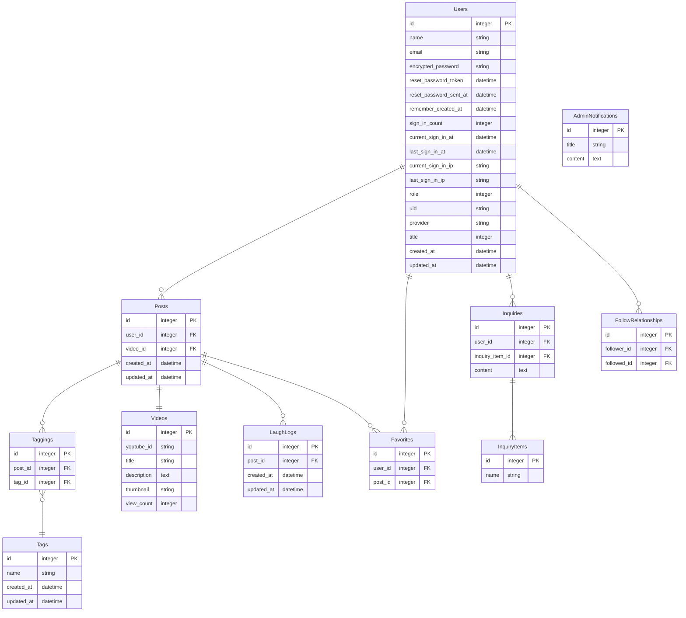

```mermaid
erDiagram
  Users ||--o{ Posts : ""
  Posts ||--o{ Taggings : ""
  Taggings }o--|| Tags : ""
  Posts ||--|| Videos : ""
  Posts ||--o{ LaughLogs : ""
  Users ||--o{ Favorites : ""
  Posts ||--o{ Favorites : ""
  Users ||--o{ Inquiries : ""
  Inquiries ||--|{ InquiryItems : ""
  Users ||--o{ FollowRelationships : ""

  Users {
    id integer PK
    name string
    email string
    encrypted_password string
    reset_password_token datetime
    reset_password_sent_at datetime
    remember_created_at datetime
    sign_in_count integer
    current_sign_in_at datetime
    last_sign_in_at datetime
    current_sign_in_ip string
    last_sign_in_ip string
    role integer
    uid string
    provider string
    title integer
    created_at datetime
    updated_at datetime
  }

  Posts {
    id integer PK
    user_id integer FK
    video_id integer FK
    created_at datetime
    updated_at datetime
  }

  Videos {
    id integer PK
    youtube_id string
    title string
    description text
    thumbnail string
    view_count integer
  }

  LaughLogs {
    id integer PK
    post_id integer FK
    created_at datetime
    updated_at datetime
  }

  Tags {
    id integer PK
    name string
    created_at datetime
    updated_at datetime
  }

  Taggings {
    id integer PK
    post_id integer FK
    tag_id integer FK
  }

  Favorites {
    id integer PK
    user_id integer FK
    post_id integer FK
  }

  FollowRelationships {
    id integer PK
    follower_id integer FK
    followed_id integer FK
  }

  AdminNotifications {
    id integer PK
    title string
    content text
  }

  Inquiries {
    id integer PK
    user_id integer FK
    inquiry_item_id integer FK
    content text
  }

  InquiryItems {
    id integer PK
    name string
  }

```