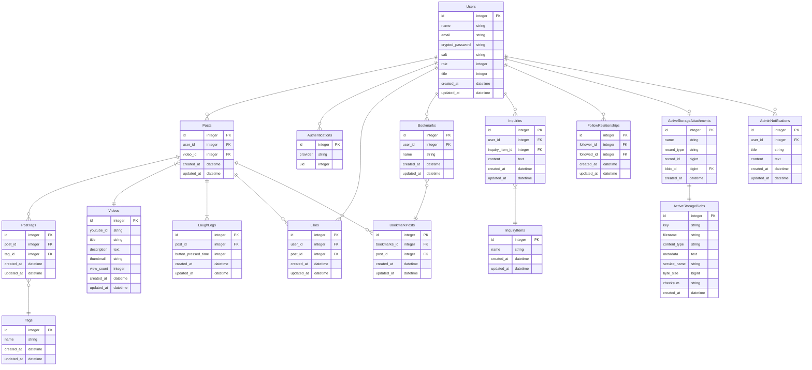

```mermaid
erDiagram
  Users ||--o{ Posts : ""
  Users ||--o{ Authentications : ""
  Posts ||--o{ PostTags : ""
  PostTags }o--|| Tags : ""
  Posts }|--|| Videos : ""
	Posts ||--|{ LaughLogs : ""
  Users ||--o{ Likes : ""
  Posts ||--o{ Likes : ""
  Users ||--o{ Bookmarks : ""
  Bookmarks }o--|| BookmarkPosts : ""
  Posts ||--o{ BookmarkPosts : ""
  Users ||--o{ Inquiries : ""
  Inquiries }|--|| InquiryItems : ""
  Users ||--o{ FollowRelationships : ""
  Users ||--o| ActiveStorageAttachments : ""
  ActiveStorageAttachments ||--|| ActiveStorageBlobs : ""
  Users ||--o{ AdminNotifications : ""

  Users {
    id integer PK
    name string
    email string
    crypted_password string
    salt string
    role integer
    title integer
    created_at datetime
    updated_at datetime
  }

  Authentications {
    id integer PK
    provider string
    uid integer
  }

  Posts {
    id integer PK
    user_id integer FK
    video_id integer FK
    created_at datetime
    updated_at datetime
  }

  Videos {
    id integer PK
    youtube_id string
    title string
    description text
    thumbnail string
    view_count integer
    created_at datetime
    updated_at datetime
  }

  LaughLogs {
    id integer PK
    post_id integer FK
    button_pressed_time integer
    created_at datetime
    updated_at datetime
  }

  Tags {
    id integer PK
    name string
    created_at datetime
    updated_at datetime
  }

  PostTags {
    id integer PK
    post_id integer FK
    tag_id integer FK
    created_at datetime
    updated_at datetime
  }

  ActiveStorageBlobs {
    id integer PK
    key string
    filename string
    content_type string
    metadata text
    service_name string
    byte_size bigint
    checksum string
    created_at datetime
  }

  ActiveStorageAttachments {
    id integer PK
    name string
    record_type string
    record_id bigint
    blob_id bigint FK
    created_at datetime
  }

  Bookmarks {
    id integer PK
    user_id integer FK
    name string
    created_at datetime
    updated_at datetime
  }

  BookmarkPosts {
    id integer PK
    bookmarks_id integer FK
    post_id integer FK
    created_at datetime
    updated_at datetime
  }

  Likes {
    id integer PK
    user_id integer FK
    post_id integer FK
    created_at datetime
    updated_at datetime
  }

  FollowRelationships {
    id integer PK
    follower_id integer FK
    followed_id integer FK
    created_at datetime
    updated_at datetime
  }

  AdminNotifications {
    id integer PK
    user_id integer FK
    title string
    content text
    created_at datetime
    updated_at datetime
  }

  Inquiries {
    id integer PK
    user_id integer FK
    inquiry_item_id integer FK
    content text
    created_at datetime
    updated_at datetime
  }

  InquiryItems {
    id integer PK
    name string
    created_at datetime
    updated_at datetime
  }
```